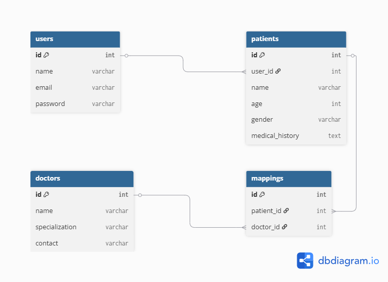
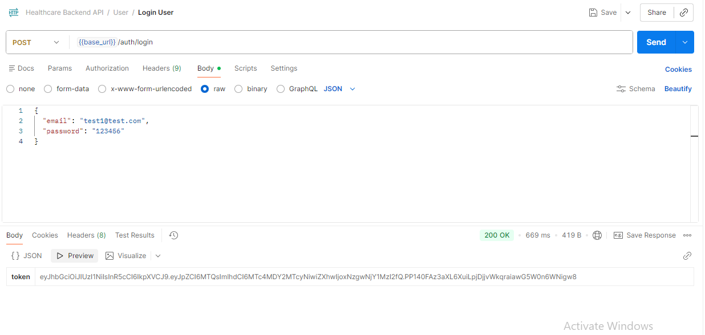
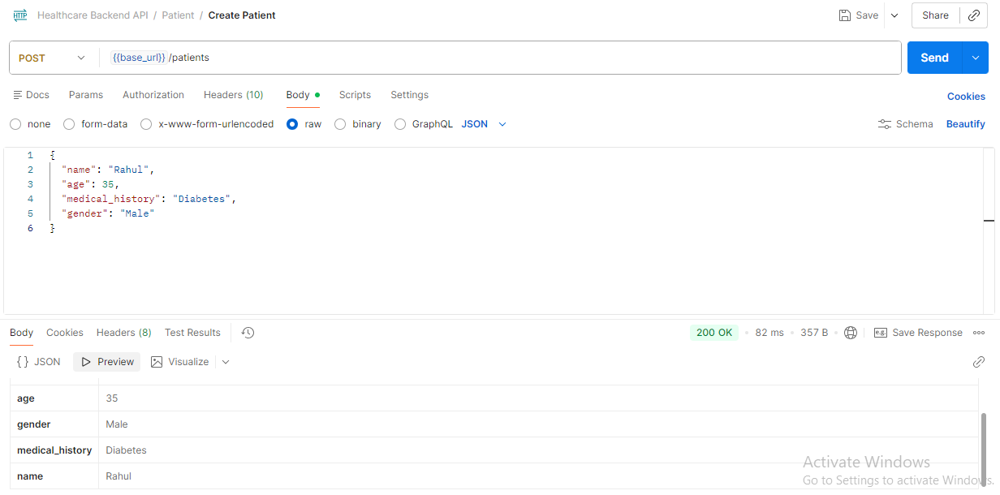
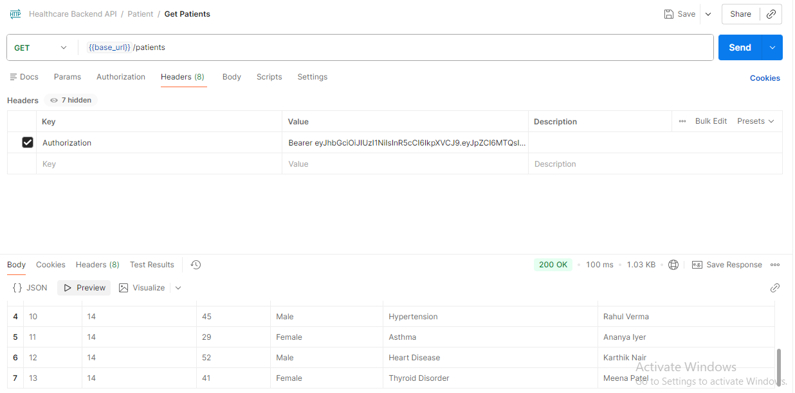

<div align="center">


# HEALTHCARE-BACKEND

### A secure healthcare management backend API for managing patients, doctors, and healthcare records using Node.js, Express.js, and PostgreSQL

[](https://github.com/reshabweb/HEALTHCARE-BACKEND/stargazers)
[](https://github.com/reshabweb/HEALTHCARE-BACKEND/forks)
[](https://github.com/reshabweb/HEALTHCARE-BACKEND/issues)
[](https://github.com/reshabweb/HEALTHCARE-BACKEND/blob/main/LICENSE)
</div>

---

## 📖 Overview

Healthcare Backend is a RESTful API built to streamline healthcare data management by enabling secure management of patients, doctors, and doctor-patient relationships.

The application provides JWT-based authentication, patient management, doctor management, and mapping functionality while following a scalable controller-route architecture. The backend is powered by PostgreSQL and demonstrates secure authentication, relational database design, and REST API development best practices.

### 🎯 Project Goals

* Secure user authentication and authorization
* Manage patient records efficiently
* Manage doctor information
* Maintain doctor-patient relationships
* Implement scalable backend architecture
* Demonstrate PostgreSQL relational database design

---

## 🗄️ Database Schema

### Entity Relationship Diagram



### Relationships

- One User can manage multiple Patients.
- One Patient can be assigned to multiple Doctors.
- One Doctor can manage multiple Patients.
- The `mappings` table implements the many-to-many relationship between Patients and Doctors.

---

## 📸 Screenshots

### User Login API



### Create Patient API



### Get Patients API



---

## ✨ Features

### 🔐 Authentication & Security

* User Registration
* User Login
* JWT Authentication
* Protected Routes
* Password Hashing using bcrypt
* Environment Variable Security

### 🏥 Patient Management

* Create Patient
* Retrieve Patient Information
* Update Patient Records
* Delete Patient Records

### 👨‍⚕️ Doctor Management

* Create Doctor
* Retrieve Doctor Information
* Update Doctor Records
* Delete Doctor Records

### 🔗 Doctor-Patient Mapping

* Assign Doctors to Patients
* Retrieve Mapping Information
* Update Existing Mappings
* Remove Assignments

### ⚡ Backend Features

* RESTful API Design
* PostgreSQL Integration
* Modular Architecture
* Middleware-Based Authentication
* Scalable Folder Structure

---

## 🚀 Tech Stack

<p align="left">
  
</p>


---

## 🏗️ Architecture

```text
Client
   │
   ▼
Express API
   │
   ├── Routes
   ├── Controllers
   ├── Authentication Middleware
   └── PostgreSQL Database
```

### Request Flow

1. Client sends request.
2. Routes receive the request.
3. Middleware validates JWT token.
4. Controllers execute business logic.
5. PostgreSQL performs database operations.
6. Response is returned to the client.

---

## 📂 Project Structure

```text
HEALTHCARE-BACKEND
│
├── config/
│   └── db.js
│
├── controllers/
│   ├── authController.js
│   ├── patientController.js
│   ├── doctorController.js
│   └── mappingController.js
│
├── middleware/
│   └── authMiddleware.js
│
├── routes/
│   ├── authRoutes.js
│   ├── patientRoutes.js
│   ├── doctorRoutes.js
│   └── mappingRoutes.js
│
├── screenshots/
│   ├── er-diagram.png
│   ├── login.png
│   ├── create-patient.png
│   └── get-patients.png
│
├── .env.example
├── package.json
└── index.js
```

---

## ⚙️ Installation

```bash
# Clone the repository
git clone https://github.com/reshabweb/HEALTHCARE-BACKEND.git

# Navigate into project
cd HEALTHCARE-BACKEND

# Install dependencies
npm install
```

### Environment Variables

Create a `.env` file in the root directory:

```env
PORT=5000

DB_USER=your_database_username
DB_PASS=your_database_password
DB_HOST=localhost
DB_PORT=5432
DB_NAME=your_database_name

JWT_SECRET=your_secret_key
```

---

## 🚀 Usage

### Start Development Server

```bash
npm run dev
```

### Start Production Server

```bash
npm start
```

Server runs on:

```text
http://localhost:5000
```

---

## 📋 API Endpoints

### 🔐 Authentication

| Method | Endpoint | Description |
|---------|----------|-------------|
| POST | `/api/auth/register` | Register a new user account |
| POST | `/api/auth/login` | Authenticate user and return JWT token |

---

### 🏥 Patients

| Method | Endpoint | Description |
|---------|----------|-------------|
| POST | `/api/patients` | Create a new patient record |
| GET | `/api/patients` | Retrieve all patients associated with the authenticated user |
| GET | `/api/patients/:id` | Retrieve a specific patient by ID |
| PUT | `/api/patients/:id` | Update patient information |
| DELETE | `/api/patients/:id` | Delete a patient record |

---

### 👨‍⚕️ Doctors

| Method | Endpoint | Description |
|---------|----------|-------------|
| POST | `/api/doctors` | Create a new doctor record |
| GET | `/api/doctors` | Retrieve all doctors |
| GET | `/api/doctors/:id` | Retrieve a specific doctor by ID |
| PUT | `/api/doctors/:id` | Update doctor information |
| DELETE | `/api/doctors/:id` | Delete a doctor record |

---

### 🔗 Doctor-Patient Mapping

| Method | Endpoint | Description |
|---------|----------|-------------|
| POST | `/api/mappings` | Assign a doctor to a patient |
| GET | `/api/mappings` | Retrieve all doctor-patient mappings |
| GET | `/api/mappings/:patient_id` | Retrieve all doctors assigned to a specific patient |
| PUT | `/api/mappings/:id` | Update an existing doctor-patient mapping |
| DELETE | `/api/mappings/:id` | Remove a doctor-patient mapping |
---

## 🎯 What I Learned

* Building secure REST APIs using Express.js
* JWT Authentication & Authorization
* Password Hashing with bcrypt
* PostgreSQL Database Integration
* Relational Database Design
* Middleware-Based Request Processing
* Backend Project Structuring
* Environment Variable Management

---

## 🚀 Future Improvements

* Role-Based Access Control (RBAC)
* Appointment Scheduling System
* Medical Record Management
* Swagger API Documentation
* Docker Support
* Automated Testing
* Redis Caching
* CI/CD Pipeline Integration

---

## 🤝 Contributing

Contributions are welcome!

1. Fork the repository
2. Create a feature branch
3. Commit your changes
4. Push to your branch
5. Open a Pull Request

---

## 👥 Contributors

<a href="https://github.com/reshabweb/HEALTHCARE-BACKEND/graphs/contributors">
  
</a>

Contributor: Reshab

---

## 📄 License

This project is licensed under the MIT License.

---

<div align="center">

⭐ Star this repo if you like it!

Made with ❤️ by [reshabweb](https://github.com/reshabweb/HEALTHCARE-BACKEND#)


</div>
